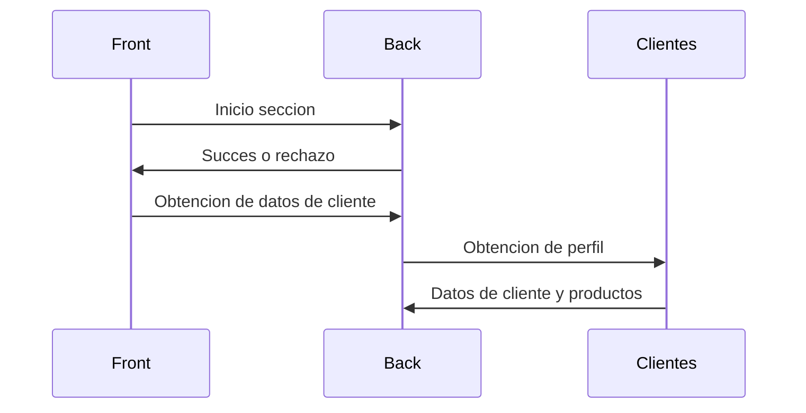

## Build
Correr usando dockerfile

Construir imagen,
```bash
docker build -t BackBase .
```
Correr imagen
```bash
docker run -p 8080:8080 -d BackBase
```

## Descripcion de arquitectura


```mermaid

sequenceDiagram
    participant Front
    participant Back
    participant Clientes
    
Front->>Back : Inicio seccion
Back->>Front : Succes o rechazo
Front->>Back : Obtencion de datos de cliente
Back->>Clientes : Obtencion de perfil
Clientes->>Back : Datos de cliente y productos
```